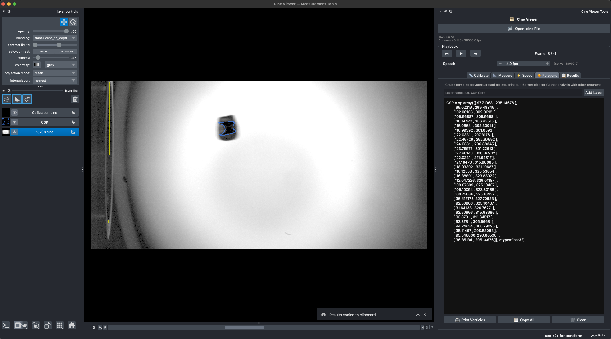

# PelletLabCineViewer

Program to view Phantom `.cine` files from the pellet lab and make calibrated
measurements — lengths, areas, pellet speed, and cylinder fits — inside
[napari](https://napari.org).



---

## Contents

- [What it does](#what-it-does)
- [Environment setup](#environment-setup)
  - [Option A — pyenv (recommended)](#option-a--pyenv-recommended)
  - [Option B — plain venv](#option-b--plain-venv)
  - [Option C — conda](#option-c--conda-apple-silicon-friendly)
- [Running](#running)
- [Using the tools](#using-the-tools)
- [The cylinder fit](#the-cylinder-fit)
- [Repository layout](#repository-layout)
- [Troubleshooting](#troubleshooting)

---

## What it does

1. Reads `.cine` files (Vision Research Phantom cameras) via `pycine`.
2. Calibrates pixels → millimetres from a line of known length.
3. Measures lengths and areas from shapes drawn on the video.
4. Tracks the pellet between two frames to get its speed.
5. Fits a parametric cylinder to a tilted, rotated pellet to recover its true
   diameter, length, volume, and mass.
6. Exports polygon vertices for downstream analysis.

---

## Environment setup

Requirements: **Python 3.11 or 3.12**, and a machine with a working OpenGL
stack (napari renders through Qt + vispy, so it needs a real display — not a
bare SSH session).

> Python 3.10 is no longer supported by napari ≥ 0.8, and 3.13 support across
> the whole dependency stack is still patchy. 3.11 is the safe choice, and is
> what `.python-version` pins.

### Option A — pyenv (recommended)

`pyenv` keeps the lab's Python version separate from the system Python, so an
OS update can't quietly break the viewer.

**Install pyenv**

macOS:

```bash
brew update
brew install pyenv pyenv-virtualenv
```

Linux:

```bash
curl -fsSL https://pyenv.run | bash
```

Then add it to your shell — for zsh (the macOS default), append to `~/.zshrc`;
for bash, append to `~/.bashrc`:

```bash
export PYENV_ROOT="$HOME/.pyenv"
export PATH="$PYENV_ROOT/bin:$PATH"
eval "$(pyenv init -)"
eval "$(pyenv virtualenv-init -)"
```

Restart the terminal, then confirm with `pyenv --version`.

**Build the environment**

```bash
git clone https://github.com/ORNL-Fusion/PelletLabCineViewer.git
cd PelletLabCineViewer

pyenv install 3.11.9              # the version pinned in .python-version
pyenv virtualenv 3.11.9 pellet    # a named virtualenv called "pellet"
pyenv local pellet                # auto-activates whenever you cd in here

python -m pip install --upgrade pip
pip install -e .                  # installs deps + the pellet-viewer command
```

`pyenv local pellet` writes the environment name into `.python-version`, so the
right interpreter activates automatically every time you enter the directory —
no `source activate` to forget.

> On macOS, `pyenv install` compiles CPython from source and needs the command
> line tools: `xcode-select --install`.

### Option B — plain venv

If you already have Python 3.11+ installed and don't want another version
manager:

```bash
git clone https://github.com/ORNL-Fusion/PelletLabCineViewer.git
cd PelletLabCineViewer

python3.11 -m venv .venv
source .venv/bin/activate         # Windows: .venv\Scripts\activate

python -m pip install --upgrade pip
pip install -e .
```

To leave the environment: `deactivate`.

### Option C — conda (Apple Silicon friendly)

napari's own docs recommend conda-forge on arm64 Macs, because the Qt builds
there are better behaved:

```bash
conda create -n pellet -c conda-forge python=3.11 napari pyqt
conda activate pellet
pip install -e .                  # picks up pycine and the rest
```

---

## Running

Any of these work once the environment is active:

```bash
pellet-viewer                                   # console script (after pip install -e .)
pellet-viewer /research/csp/lab_videos/15708.cine

python code/pelletVideoViewer.py                # plain script, no install needed
python code/pelletVideoViewer.py "/path/to/file.cine"
```

If you skipped `pip install -e .`, install the dependencies directly with
`pip install -r requirements.txt` first.

---

## Using the tools

The dock widget on the right has one tab per job:

| Tab | What it's for |
| --- | --- |
| 📏 **Calibrate** | Draw a line across an object of known size, type its real length, hit *Set calibration*. **Do this first** — every other measurement depends on it. |
| 📐 **Measure** | Lines and areas from shapes drawn on the current frame. |
| ⚡️ **Speed** | Mark the pellet in two frames; speed comes from the displacement, frame gap, and frame rate. |
| 🔸 **Polygons** | Free-hand outlines; prints vertices for analysis elsewhere. |
| 🧪 **Cylinder** | Parametric cylinder overlay — see below. |
| 📋 **Results** | Running log; copy to clipboard. |

---

## Repository layout

```
PelletLabCineViewer/
├── code/
│   ├── pelletVideoViewer.py   # napari viewer + dock widget (entry point)
│   └── pellet_cylinder.py     # cylinder geometry + Cylinder tab
├── images/
├── pyproject.toml             # packaging + dependencies
├── requirements.txt           # same deps, for a plain pip install
├── .python-version            # pyenv pin (committed on purpose)
└── README.md
```

`code/` is deliberately **not** a Python package — a package named `code` would
shadow the standard library's `code` module. Instead `pelletVideoViewer.py`
puts its own directory on `sys.path` at import time, so sibling modules resolve
whether you run it as a script, as an installed console command, or import it
from a notebook. `pyproject.toml` exposes both files as top-level modules via
`package-dir = {"" = "code"}`.

---
